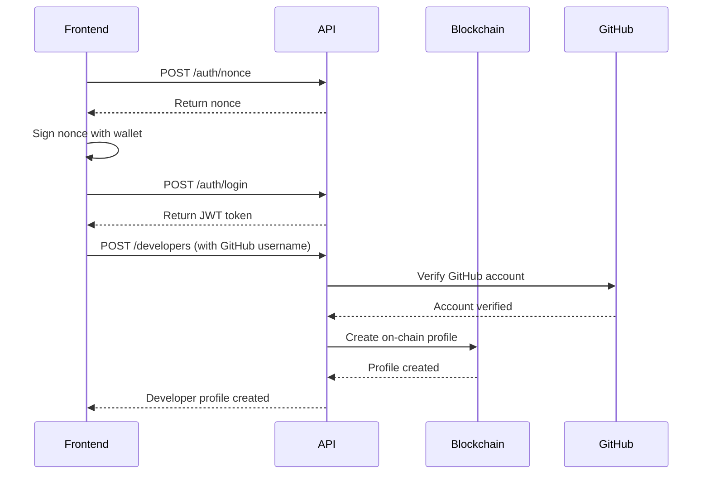
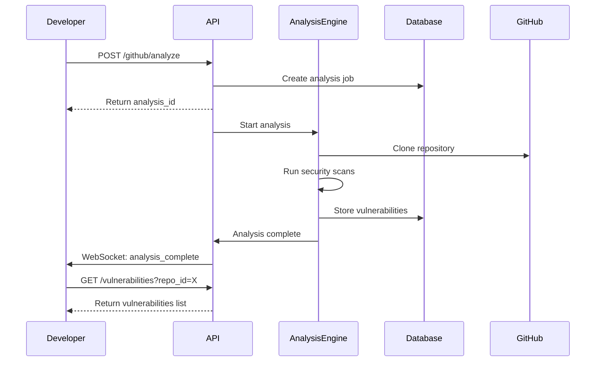
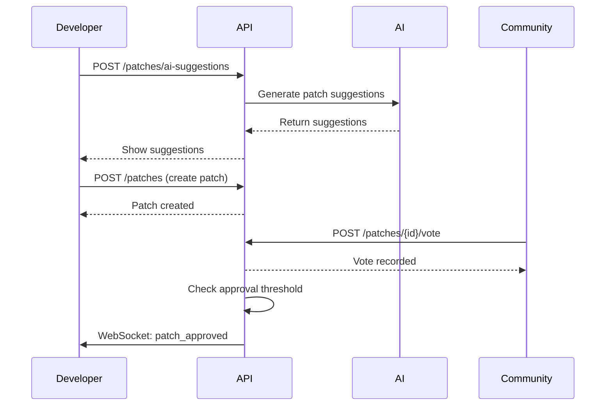
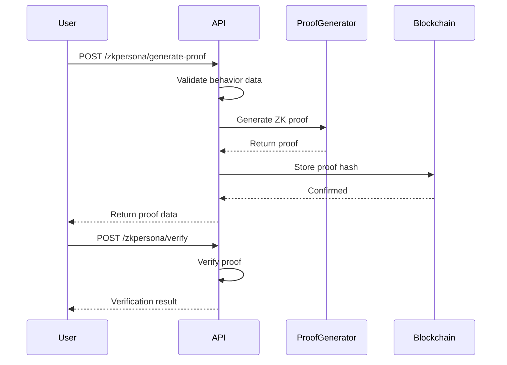

# JDBlog API Documentation

## Overview

JDBlog is a decentralized platform that combines GitHub integration, security vulnerability analysis, AI-powered patch generation, and ZK-proof based developer reputation system. The server provides RESTful APIs and WebSocket support for real-time features.

## Base URL

```
http://localhost:8080
```

## API Version

Current version: `v1`

All API endpoints are prefixed with `/api/v1/`

## Table of Contents

1. [Authentication](#authentication)
2. [ZK-Persona Service](#zk-persona-service)
3. [Analytics Service](#analytics-service)
4. [Vulnerability Service](#vulnerability-service)
5. [Patch Service](#patch-service)
6. [Developer Service](#developer-service)
7. [GitHub Service](#github-service)
8. [SUI Service](#sui-service)
9. [RPC Endpoints](#rpc-endpoints)
10. [Error Handling](#error-handling)
11. [WebSocket Events](#websocket-events)

---

## Authentication

### Overview

The platform uses JWT-based authentication with SUI wallet integration for ZK-Persona features.

### Generate Nonce

Generate a nonce for wallet signature verification.

```http
POST /api/v1/zkpersona/auth/nonce
```

#### Request Body

```json
{
  "address": "0x1234567890abcdef1234567890abcdef1234567890abcdef1234567890abcdef"
}
```

#### Response

```json
{
  "data": {
    "nonce": "random_nonce_string_here",
    "expires_at": "2024-01-15T12:00:00Z"
  }
}
```

### Login

Authenticate with wallet signature.

```http
POST /api/v1/zkpersona/auth/login
```

#### Request Body

```json
{
  "address": "0x1234567890abcdef1234567890abcdef1234567890abcdef1234567890abcdef",
  "signature": "signature_of_nonce",
  "public_key": "user_public_key"
}
```

#### Response

```json
{
  "data": {
    "access_token": "jwt_token_here",
    "refresh_token": "refresh_token_here",
    "expires_in": 3600,
    "user": {
      "id": "user_id",
      "address": "0x1234...",
      "created_at": "2024-01-15T10:00:00Z"
    }
  }
}
```

### Protected Endpoints

For protected endpoints, include the JWT token in the Authorization header:

```http
Authorization: Bearer <jwt_token>
```

---

## ZK-Persona Service

### Generate Proof (Protected)

Generate a ZK proof for user behavior and reputation.

```http
POST /api/v1/zkpersona/generate-proof
Authorization: Bearer <jwt_token>
```

#### Request Body

```json
{
  "behavior_input": {
    "transactions": [
      {
        "type": "swap",
        "amount": 1000,
        "timestamp": "2024-01-01T00:00:00Z"
      },
      {
        "type": "stake",
        "amount": 500,
        "timestamp": "2024-01-02T00:00:00Z"
      }
    ],
    "interactions": {
      "dao_votes": 3,
      "nft_trades": 2,
      "defi_protocols": ["uniswap", "aave", "compound"]
    }
  },
  "session_id": "unique-session-id"
}
```

#### Response

```json
{
  "data": {
    "proof_id": "proof_uuid",
    "proof_data": "base64_encoded_proof",
    "verification_key": "verification_key_data",
    "public_signals": {
      "reputation_score": 85,
      "activity_level": "high",
      "verified_timestamp": "2024-01-15T12:00:00Z"
    },
    "metadata": {
      "circuit_version": "1.0.0",
      "proving_time_ms": 1234
    }
  }
}
```

### Verify Proof (Public)

Verify a ZK proof.

```http
POST /api/v1/zkpersona/verify
```

#### Request Body

```json
{
  "proof_data": "base64_encoded_proof",
  "verification_key": "verification_key_data",
  "public_signals": {
    "reputation_score": 85,
    "activity_level": "high",
    "verified_timestamp": "2024-01-15T12:00:00Z"
  }
}
```

#### Response

```json
{
  "valid": true,
  "verified_at": "2024-01-15T12:05:00Z",
  "public_outputs": {
    "reputation_score": 85,
    "activity_level": "high"
  }
}
```

---

## Analytics Service

### Get Metrics

Get platform-wide metrics and statistics.

```http
GET /api/v1/analytics/metrics
```

#### Response

```json
{
  "total_repositories": 1234,
  "total_vulnerabilities": 5678,
  "patches_generated": 890,
  "active_developers": 345,
  "metrics_by_period": {
    "daily": {
      "new_repositories": 12,
      "vulnerabilities_found": 45,
      "patches_applied": 8
    },
    "weekly": {
      "new_repositories": 78,
      "vulnerabilities_found": 312,
      "patches_applied": 56
    }
  }
}
```

### Get Top Repositories

Get top repositories by various metrics.

```http
GET /api/v1/analytics/top-repositories?limit=10&time_period=week&metric=security_score
```

#### Query Parameters

- `limit` (optional): Number of results (default: 10, max: 100)
- `time_period` (optional): `day`, `week`, `month`, `year` (default: `week`)
- `metric` (optional): `security_score`, `activity`, `patches` (default: `security_score`)

#### Response

```json
{
  "repositories": [
    {
      "id": "repo_uuid",
      "name": "owner/repo",
      "security_score": 92.5,
      "vulnerabilities_count": 2,
      "patches_applied": 15,
      "last_analysis": "2024-01-15T10:00:00Z"
    }
  ],
  "time_period": "week",
  "metric": "security_score"
}
```

### Get Activity Trends

Get platform activity trends over time.

```http
GET /api/v1/analytics/trends/activity?period=daily&days=7
```

#### Query Parameters

- `period`: `hourly`, `daily`, `weekly`, `monthly`
- `days`/`weeks`/`months`: Number of periods to retrieve

#### Response

```json
{
  "period": "daily",
  "data": [
    {
      "timestamp": "2024-01-08T00:00:00Z",
      "repositories_analyzed": 45,
      "vulnerabilities_found": 123,
      "patches_generated": 34,
      "developers_active": 67
    },
    {
      "timestamp": "2024-01-09T00:00:00Z",
      "repositories_analyzed": 52,
      "vulnerabilities_found": 145,
      "patches_generated": 41,
      "developers_active": 73
    }
  ]
}
```

### Get Vulnerability Trends

Get vulnerability detection trends.

```http
GET /api/v1/analytics/trends/vulnerabilities?period=weekly&weeks=4
```

#### Response

```json
{
  "period": "weekly",
  "data": [
    {
      "week_start": "2024-01-01T00:00:00Z",
      "by_severity": {
        "critical": 12,
        "high": 45,
        "medium": 89,
        "low": 234
      },
      "by_type": {
        "sql_injection": 23,
        "xss": 45,
        "buffer_overflow": 12,
        "other": 300
      }
    }
  ]
}
```

---

## Vulnerability Service

### List Vulnerabilities

Get a paginated list of vulnerabilities.

```http
GET /api/v1/vulnerabilities?page=1&limit=20&severity=high&status=open
```

#### Query Parameters

- `page` (optional): Page number (default: 1)
- `limit` (optional): Items per page (default: 20, max: 100)
- `severity` (optional): Filter by severity: `critical`, `high`, `medium`, `low`
- `status` (optional): Filter by status: `open`, `in_progress`, `resolved`, `false_positive`
- `repository_id` (optional): Filter by repository UUID

#### Response

```json
{
  "vulnerabilities": [
    {
      "id": "vuln_uuid",
      "repository_id": "repo_uuid",
      "vulnerability_type": "sql_injection",
      "severity": "high",
      "status": "open",
      "title": "SQL Injection in user authentication",
      "description": "Unsanitized user input in login query",
      "file_path": "src/auth/login.rs",
      "line_number": 45,
      "code_snippet": "let query = format!(\"SELECT * FROM users WHERE username = '{}'\", username);",
      "detected_by": "static_analysis",
      "detected_at": "2024-01-15T10:00:00Z",
      "cve_id": "CVE-2024-1234",
      "cvss_score": 7.5
    }
  ],
  "total_count": 156,
  "page": 1,
  "limit": 20,
  "has_more": true
}
```

### Get Vulnerability by ID

Get detailed information about a specific vulnerability.

```http
GET /api/v1/vulnerabilities/{vulnerability_id}
```

#### Response

```json
{
  "vulnerability": {
    "id": "vuln_uuid",
    "repository_id": "repo_uuid",
    "vulnerability_type": "sql_injection",
    "severity": "high",
    "status": "open",
    "title": "SQL Injection in user authentication",
    "description": "Detailed description of the vulnerability...",
    "file_path": "src/auth/login.rs",
    "line_number": 45,
    "code_snippet": "let query = format!(\"SELECT * FROM users WHERE username = '{}'\", username);",
    "detected_by": "static_analysis",
    "detected_at": "2024-01-15T10:00:00Z",
    "resolved_at": null,
    "resolved_by": null,
    "patch_proposal_id": null,
    "cve_id": "CVE-2024-1234",
    "cvss_score": 7.5,
    "created_at": "2024-01-15T10:00:00Z",
    "updated_at": "2024-01-15T10:00:00Z"
  }
}
```

### Search Vulnerabilities

Search for vulnerabilities by keyword.

```http
POST /api/v1/vulnerabilities/search
```

#### Request Body

```json
{
  "query": "sql injection",
  "limit": 10,
  "filters": {
    "severity": ["high", "critical"],
    "status": ["open", "in_progress"]
  }
}
```

#### Response

```json
{
  "total_matches": 23,
  "vulnerabilities": [
    {
      "id": "vuln_uuid",
      "title": "SQL Injection vulnerability",
      "repository_name": "owner/repo",
      "severity": "high",
      "status": "open",
      "match_snippet": "...sql injection vulnerability found in...",
      "relevance_score": 0.95
    }
  ],
  "search_query": "sql injection"
}
```

### Get Vulnerability Types

Get all vulnerability types with statistics.

```http
GET /api/v1/vulnerabilities/types
```

#### Response

```json
{
  "types": [
    {
      "type_name": "sql_injection",
      "count": 145,
      "average_severity": 3.2
    },
    {
      "type_name": "xss",
      "count": 234,
      "average_severity": 2.8
    }
  ],
  "total_vulnerabilities": 1234
}
```

### Get Vulnerabilities by Severity

Get vulnerabilities filtered by severity level.

```http
GET /api/v1/vulnerabilities/severity/{severity}?page=1&limit=10
```

#### Path Parameters

- `severity`: The severity level: `critical`, `high`, `medium`, `low`

#### Query Parameters

- `page` (optional): Page number (default: 1)
- `limit` (optional): Items per page (default: 10, max: 100)

#### Response

```json
{
  "vulnerabilities": [
    {
      "id": "vuln_uuid",
      "repository_id": "repo_uuid",
      "vulnerability_type": "sql_injection",
      "severity": "high",
      "status": "open",
      "title": "SQL Injection in user authentication",
      "description": "Unsanitized user input in login query",
      "file_path": "src/auth/login.rs",
      "line_number": 45,
      "detected_at": "2024-01-15T10:00:00Z"
    }
  ],
  "total_count": 156,
  "page": 1,
  "limit": 10,
  "has_more": true,
  "severity": "high"
}
```

### Get Repository Vulnerabilities

Get vulnerabilities for a specific repository.

```http
GET /api/v1/vulnerabilities/repository/{repository_id}?page=1&limit=10
```

#### Path Parameters

- `repository_id`: The repository UUID

#### Query Parameters

- `page` (optional): Page number (default: 1)
- `limit` (optional): Items per page (default: 10, max: 100)

#### Response

```json
{
  "vulnerabilities": [
    {
      "id": "vuln_uuid",
      "repository_id": "repo_uuid",
      "vulnerability_type": "sql_injection",
      "severity": "high",
      "status": "open",
      "title": "SQL Injection in user authentication",
      "description": "Unsanitized user input in login query",
      "file_path": "src/auth/login.rs",
      "line_number": 45,
      "detected_at": "2024-01-15T10:00:00Z"
    }
  ],
  "total_count": 45,
  "page": 1,
  "limit": 10,
  "has_more": true,
  "repository_id": "repo_uuid"
}
```

### Get Repository Vulnerability Summary

Get vulnerability summary for a specific repository.

```http
GET /api/v1/vulnerabilities/repository/{repository_id}/summary
```

#### Response

```json
{
  "summary": {
    "repository_id": "repo_uuid",
    "total_count": 45,
    "by_severity": {
      "critical": 2,
      "high": 8,
      "medium": 15,
      "low": 20
    },
    "by_status": {
      "open": 25,
      "in_progress": 10,
      "resolved": 8,
      "false_positive": 2,
      "ignored": 0
    },
    "average_resolution_time": 72
  },
  "generated_at": "2024-01-15T12:00:00Z"
}
```

---

## Patch Service

### List Patches

Get a paginated list of patches.

```http
GET /api/v1/patches?page=1&limit=20&status=approved
```

#### Query Parameters

- `page` (optional): Page number (default: 1)
- `limit` (optional): Items per page (default: 20, max: 100)
- `status` (optional): Filter by status: `proposed`, `under_review`, `approved`, `rejected`, `applied`
- `repository_id` (optional): Filter by repository UUID
- `vulnerability_id` (optional): Filter by vulnerability UUID

#### Response

```json
{
  "patches": [
    {
      "id": "patch_uuid",
      "vulnerability_id": "vuln_uuid",
      "repository_id": "repo_uuid",
      "title": "Fix SQL injection vulnerability",
      "description": "Replace string formatting with parameterized queries",
      "diff_content": "--- a/src/auth/login.rs\n+++ b/src/auth/login.rs\n@@ -45,7 +45,7 @@\n-let query = format!(\"SELECT * FROM users WHERE username = '{}'\", username);\n+let query = sqlx::query!(\"SELECT * FROM users WHERE username = $1\", username);",
      "patch_type": "ai_generated",
      "status": "approved",
      "confidence_score": 0.95,
      "created_at": "2024-01-15T11:00:00Z"
    }
  ],
  "total_count": 89,
  "page": 1,
  "limit": 20,
  "has_more": true
}
```

### Get Patch by ID

Get detailed information about a specific patch.

```http
GET /api/v1/patches/{patch_id}
```

#### Response

```json
{
  "patch": {
    "id": "patch_uuid",
    "vulnerability_id": "vuln_uuid",
    "repository_id": "repo_uuid",
    "proposed_by_developer_id": "dev_uuid",
    "title": "Fix SQL injection vulnerability",
    "description": "Detailed description of the patch...",
    "diff_content": "Full diff content...",
    "patch_type": "ai_generated",
    "status": "approved",
    "confidence_score": 0.95,
    "community_votes_for": 15,
    "community_votes_against": 2,
    "approval_threshold_met": true,
    "github_pr_number": 123,
    "applied_at": null,
    "created_at": "2024-01-15T11:00:00Z",
    "updated_at": "2024-01-15T12:00:00Z"
  }
}
```

### Get AI Patch Suggestions

Generate AI-powered patch suggestions for a vulnerability.

```http
POST /api/v1/patches/ai-suggestions
```

#### Request Body

```json
{
  "vulnerability_id": "vuln_uuid",
  "context": {
    "file_path": "src/auth/login.rs",
    "code_snippet": "let query = format!(\"SELECT * FROM users WHERE username = '{}'\", username);",
    "language": "rust",
    "surrounding_code": "function context here...",
    "additional_context": "This is part of the authentication module"
  }
}
```

#### Response

```json
{
  "suggestions": [
    {
      "id": "suggestion_1",
      "title": "Use parameterized queries",
      "description": "Replace string formatting with parameterized queries to prevent SQL injection",
      "diff_preview": "--- a/src/auth/login.rs\n+++ b/src/auth/login.rs\n@@ -45,7 +45,7 @@\n-let query = format!(\"SELECT * FROM users WHERE username = '{}'\", username);\n+let query = sqlx::query!(\"SELECT * FROM users WHERE username = $1\", username);",
      "confidence_score": 0.95,
      "explanation": "This approach prevents SQL injection by using prepared statements..."
    },
    {
      "id": "suggestion_2",
      "title": "Input validation approach",
      "description": "Add input validation before query execution",
      "diff_preview": "...",
      "confidence_score": 0.85,
      "explanation": "Alternative approach using input validation..."
    }
  ],
  "vulnerability_analysis": {
    "type": "sql_injection",
    "severity": "high",
    "affected_lines": [45, 46, 47]
  }
}
```

### Create Patch

Create a new patch proposal.

```http
POST /api/v1/patches
```

#### Request Body

```json
{
  "vulnerability_id": "vuln_uuid",
  "repository_id": "repo_uuid",
  "title": "Fix SQL injection vulnerability",
  "description": "Replace string formatting with parameterized queries",
  "diff_content": "--- a/src/auth/login.rs\n+++ b/src/auth/login.rs\n@@ -45,7 +45,7 @@\n-let query = format!(\"SELECT * FROM users WHERE username = '{}'\", username);\n+let query = sqlx::query!(\"SELECT * FROM users WHERE username = $1\", username);",
  "patch_type": "community"
}
```

#### Response

```json
{
  "patch": {
    "id": "new_patch_uuid",
    "vulnerability_id": "vuln_uuid",
    "repository_id": "repo_uuid",
    "title": "Fix SQL injection vulnerability",
    "status": "proposed",
    "created_at": "2024-01-15T13:00:00Z"
  }
}
```

### Vote on Patch

Vote for or against a patch proposal.

```http
POST /api/v1/patches/{patch_id}/vote
```

#### Request Body

```json
{
  "vote": "for",
  "comment": "This is a clean solution that properly addresses the vulnerability"
}
```

#### Response

```json
{
  "patch_id": "patch_uuid",
  "vote_recorded": true,
  "current_votes": {
    "for": 16,
    "against": 2
  },
  "approval_threshold_met": true
}
```

---

## Developer Service

### List Developers

Get a paginated list of developers.

```http
GET /api/v1/developers?page=1&limit=20&sort_by=reputation
```

#### Query Parameters

- `page` (optional): Page number (default: 1)
- `limit` (optional): Items per page (default: 20, max: 100)
- `sort_by` (optional): Sort by: `reputation`, `contributions`, `created_at` (default: `reputation`)
- `order` (optional): Sort order: `asc`, `desc` (default: `desc`)

#### Response

```json
{
  "developers": [
    {
      "id": "dev_uuid",
      "wallet_address": "0x1234...",
      "github_username": "developer123",
      "reputation_score": 92.5,
      "contributions_count": 145,
      "patches_accepted": 89,
      "vulnerabilities_reported": 56,
      "coding_reputation_score": 88.0,
      "security_awareness_score": 95.0,
      "community_trust_score": 90.0,
      "created_at": "2023-06-15T10:00:00Z"
    }
  ],
  "total_count": 345,
  "page": 1,
  "limit": 20,
  "has_more": true
}
```

### Get Developer by ID

Get detailed information about a specific developer.

```http
GET /api/v1/developers/{developer_id}
```

#### Response

```json
{
  "developer": {
    "id": "dev_uuid",
    "wallet_address": "0x1234567890abcdef...",
    "github_username": "developer123",
    "email": "dev@example.com",
    "reputation_score": 92.5,
    "contributions_count": 145,
    "patches_accepted": 89,
    "patches_rejected": 12,
    "vulnerabilities_reported": 56,
    "false_positive_rate": 0.05,
    "average_patch_quality": 0.89,
    "coding_reputation_score": 88.0,
    "security_awareness_score": 95.0,
    "community_trust_score": 90.0,
    "zk_proof_hash": "proof_hash_here",
    "specializations": ["rust", "smart_contracts", "security"],
    "achievements": [
      {
        "type": "patch_master",
        "earned_at": "2024-01-10T00:00:00Z",
        "description": "Submitted 100 approved patches"
      }
    ],
    "created_at": "2023-06-15T10:00:00Z",
    "updated_at": "2024-01-15T12:00:00Z"
  }
}
```

### Search Developers

Search for developers by skills or username.

```http
POST /api/v1/developers/search
```

#### Request Body

```json
{
  "query": "rust smart contracts",
  "limit": 10,
  "filters": {
    "min_reputation": 80,
    "specializations": ["rust", "security"]
  }
}
```

#### Response

```json
{
  "developers": [
    {
      "id": "dev_uuid",
      "github_username": "rustdev123",
      "reputation_score": 92.5,
      "specializations": ["rust", "smart_contracts", "security"],
      "match_score": 0.95
    }
  ],
  "total_matches": 23,
  "search_query": "rust smart contracts"
}
```

### Get Developer Statistics

Get detailed statistics for a developer.

```http
GET /api/v1/developers/{developer_id}/statistics
```

#### Response

```json
{
  "developer_id": "dev_uuid",
  "statistics": {
    "contributions": {
      "total": 145,
      "last_30_days": 12,
      "last_90_days": 34,
      "by_type": {
        "patches": 89,
        "vulnerability_reports": 56,
        "code_reviews": 78
      }
    },
    "patch_statistics": {
      "total_submitted": 101,
      "accepted": 89,
      "rejected": 12,
      "acceptance_rate": 0.88,
      "average_review_time_hours": 24,
      "by_severity": {
        "critical": 15,
        "high": 34,
        "medium": 40,
        "low": 12
      }
    },
    "vulnerability_statistics": {
      "total_reported": 56,
      "confirmed": 53,
      "false_positives": 3,
      "accuracy_rate": 0.95,
      "by_type": {
        "sql_injection": 12,
        "xss": 23,
        "buffer_overflow": 8,
        "other": 13
      }
    },
    "reputation_history": [
      {
        "date": "2024-01-01T00:00:00Z",
        "score": 88.5
      },
      {
        "date": "2024-01-15T00:00:00Z",
        "score": 92.5
      }
    ]
  },
  "generated_at": "2024-01-15T12:00:00Z"
}
```

### Get Developer's Repositories

Get repositories associated with a developer.

```http
GET /api/v1/developers/{developer_id}/repositories?page=1&limit=10
```

#### Response

```json
{
  "repositories": [
    {
      "id": "repo_uuid",
      "github_repo_id": 123456,
      "full_name": "developer/awesome-project",
      "role": "maintainer",
      "contributions_count": 234,
      "last_contribution": "2024-01-14T00:00:00Z",
      "security_score": 89.5
    }
  ],
  "total_count": 15,
  "page": 1,
  "limit": 10,
  "has_more": true
}
```

### Get Developer's Contributions

Get a developer's contribution history.

```http
GET /api/v1/developers/{developer_id}/contributions?days=30
```

#### Path Parameters

- `developer_id`: The developer UUID

#### Query Parameters

- `days` (optional): Number of days to retrieve (default: 30, max: 365)

#### Response

```json
{
  "developer_id": "dev_uuid",
  "contributions": [
    {
      "date": "2024-01-15T00:00:00Z",
      "patches_submitted": 3,
      "vulnerabilities_reported": 1,
      "code_reviews": 5,
      "reputation_change": 2.5
    },
    {
      "date": "2024-01-14T00:00:00Z",
      "patches_submitted": 1,
      "vulnerabilities_reported": 2,
      "code_reviews": 3,
      "reputation_change": 1.8
    }
  ],
  "summary": {
    "total_patches": 4,
    "total_vulnerabilities": 3,
    "total_reviews": 8,
    "total_reputation_change": 4.3
  },
  "period_days": 30
}
```

### Get Top Developers

Get top developers by various metrics.

```http
GET /api/v1/developers/top?metric=reputation&limit=10&time_period=month
```

#### Query Parameters

- `metric`: `reputation`, `contributions`, `patches`, `vulnerabilities`
- `limit` (optional): Number of results (default: 10, max: 100)
- `time_period` (optional): `week`, `month`, `year`, `all_time` (default: `all_time`)

#### Response

```json
{
  "developers": [
    {
      "rank": 1,
      "id": "dev_uuid",
      "github_username": "top_dev",
      "reputation_score": 98.5,
      "metric_value": 98.5,
      "change_from_previous": 2.5
    }
  ],
  "metric": "reputation",
  "time_period": "month",
  "generated_at": "2024-01-15T12:00:00Z"
}
```

---

## GitHub Service

### GitHub Webhook

Handle GitHub webhook events.

```http
POST /api/v1/github/webhook
X-Hub-Signature-256: sha256=<signature>
```

#### Request Body

```json
{
  "action": "opened",
  "pull_request": {
    "id": 1,
    "number": 123,
    "title": "Fix security vulnerability",
    "body": "This PR fixes the SQL injection vulnerability",
    "head": {
      "ref": "fix-sql-injection",
      "sha": "abc123"
    },
    "base": {
      "ref": "main",
      "sha": "def456"
    }
  },
  "repository": {
    "id": 123456,
    "full_name": "owner/repo"
  }
}
```

#### Response

```json
{
  "received": true,
  "action": "opened",
  "processing_id": "webhook_processing_uuid"
}
```

### Get Repository Info

Get information about a GitHub repository.

```http
GET /api/v1/github/repository/{owner}/{repo}
```

#### Response

```json
{
  "repository": {
    "id": "repo_uuid",
    "github_repo_id": 123456,
    "full_name": "owner/repo",
    "description": "Repository description",
    "language": "Rust",
    "stars": 1234,
    "forks": 123,
    "open_issues": 45,
    "security_score": 87.5,
    "last_analysis": "2024-01-15T10:00:00Z",
    "webhook_configured": true
  }
}
```

### Analyze Repository

Trigger analysis of a GitHub repository.

```http
POST /api/v1/github/analyze
```

#### Request Body

```json
{
  "owner": "owner",
  "repo": "repository",
  "branch": "main",
  "analysis_types": ["security", "code_quality", "dependencies"]
}
```

#### Response

```json
{
  "analysis_id": "analysis_uuid",
  "repository": "owner/repository",
  "branch": "main",
  "status": "queued",
  "estimated_time_seconds": 120,
  "queue_position": 5
}
```

### Get Analysis Status

Get the status of a repository analysis.

```http
GET /api/v1/github/analysis/{analysis_id}
```

#### Response

```json
{
  "analysis_id": "analysis_uuid",
  "repository": "owner/repository",
  "branch": "main",
  "status": "completed",
  "started_at": "2024-01-15T10:00:00Z",
  "completed_at": "2024-01-15T10:02:00Z",
  "results": {
    "vulnerabilities_found": 12,
    "code_quality_score": 85.5,
    "dependency_issues": 3
  }
}
```

---

## SUI Service

### Health Check

Check SUI service health.

```http
GET /api/v1/sui/health
```

#### Response

```json
{
  "status": "healthy",
  "connected": true,
  "network": "devnet",
  "latest_checkpoint": 123456
}
```

### Test Connection

Test SUI network connection.

```http
GET /api/v1/sui/test-connection
```

#### Response

```json
{
  "connected": true,
  "network": "devnet",
  "rpc_endpoint": "https://fullnode.devnet.sui.io",
  "latency_ms": 45
}
```

### Get Network Info

Get SUI network information.

```http
GET /api/v1/sui/network-info
```

#### Response

```json
{
  "network": "devnet",
  "epoch": 234,
  "checkpoint": 123456,
  "system_state": {
    "epoch_start_timestamp_ms": 1705320000000,
    "reference_gas_price": 1000,
    "total_stake": "1000000000000000000",
    "storage_fund_balance": "500000000000000000"
  }
}
```

### Sponsor Transaction

Sponsor a transaction for gas-free user experience.

```http
POST /api/v1/sui/sponsor-transaction
```

#### Request Body

```json
{
  "transaction_bytes": "base64_encoded_transaction",
  "sender": "0x1234...",
  "gas_budget": 1000000
}
```

#### Response

```json
{
  "sponsored": true,
  "transaction_digest": "digest_here",
  "gas_sponsor": "0xsponsor_address",
  "gas_used": 850000
}
```

---

## RPC Endpoints

### JSON-RPC Interface

Send JSON-RPC requests to various services.

```http
POST /api/rpc
```

#### Request Format

```json
{
  "jsonrpc": "2.0",
  "method": "method_name",
  "params": {
    "param1": "value1",
    "param2": "value2"
  },
  "id": 1
}
```

#### Response Format

```json
{
  "jsonrpc": "2.0",
  "result": {
    "data": "response_data"
  },
  "id": 1
}
```

#### Available Methods

- `auth.generateNonce`
- `auth.login`
- `auth.refresh`
- `zkpersona.generateProof`
- `zkpersona.verifyProof`
- `analytics.getMetrics`
- `vulnerabilities.list`
- `patches.suggest`
- `developers.getStats`

---

## Error Handling

### Error Response Format

All API errors follow a consistent format:

```json
{
  "error": {
    "code": "VALIDATION_ERROR",
    "message": "Invalid input parameters",
    "details": {
      "field": "email",
      "reason": "Invalid email format"
    }
  },
  "request_id": "req_uuid"
}
```

### Common Error Codes

| Code | HTTP Status | Description |
|------|-------------|-------------|
| `UNAUTHORIZED` | 401 | Missing or invalid authentication |
| `FORBIDDEN` | 403 | Insufficient permissions |
| `NOT_FOUND` | 404 | Resource not found |
| `VALIDATION_ERROR` | 400 | Invalid input parameters |
| `RATE_LIMITED` | 429 | Too many requests |
| `INTERNAL_ERROR` | 500 | Internal server error |

### Rate Limiting

API requests are rate limited:

- Anonymous requests: 100 requests per hour
- Authenticated requests: 1000 requests per hour
- Webhook endpoints: 10000 requests per hour

Rate limit headers:

```http
X-RateLimit-Limit: 1000
X-RateLimit-Remaining: 999
X-RateLimit-Reset: 1705324800
```

---

## WebSocket Events

### Connection

Connect to WebSocket for real-time updates:

```javascript
const ws = new WebSocket('ws://localhost:8080/ws');

ws.onopen = () => {
  // Authenticate
  ws.send(JSON.stringify({
    type: 'auth',
    token: 'jwt_token_here'
  }));
};
```

### Event Types

#### Repository Analysis Update

```json
{
  "type": "analysis_update",
  "data": {
    "repository_id": "repo_uuid",
    "analysis_id": "analysis_uuid",
    "status": "in_progress",
    "progress": 45,
    "current_step": "Scanning for vulnerabilities"
  }
}
```

#### New Vulnerability Detected

```json
{
  "type": "vulnerability_detected",
  "data": {
    "vulnerability_id": "vuln_uuid",
    "repository_id": "repo_uuid",
    "severity": "high",
    "type": "sql_injection",
    "file_path": "src/auth/login.rs"
  }
}
```

#### Patch Status Update

```json
{
  "type": "patch_update",
  "data": {
    "patch_id": "patch_uuid",
    "status": "approved",
    "votes_for": 15,
    "votes_against": 2
  }
}
```

#### Developer Reputation Update

```json
{
  "type": "reputation_update",
  "data": {
    "developer_id": "dev_uuid",
    "old_score": 88.5,
    "new_score": 92.5,
    "reason": "patch_accepted"
  }
}
```

---

## Full Flow Examples

### 1. Developer Onboarding Flow



### 2. Repository Analysis Flow



### 3. Patch Generation and Voting Flow



### 4. ZK-Proof Generation Flow



---

## Best Practices

### Authentication

1. Store JWT tokens securely (httpOnly cookies or secure storage)
2. Implement token refresh before expiration
3. Include JWT in Authorization header for all protected endpoints

### Pagination

1. Always use pagination for list endpoints
2. Default limit is 20, maximum is 100
3. Use cursor-based pagination for real-time data

### Error Handling

1. Check HTTP status codes first
2. Parse error response for detailed information
3. Implement exponential backoff for rate limits

### WebSocket Connection

1. Implement reconnection logic
2. Handle connection drops gracefully
3. Authenticate immediately after connection

### Data Validation

1. Validate input on client side
2. Handle validation errors from API
3. Show meaningful error messages to users

---

## SDK Examples

### JavaScript/TypeScript

```typescript
import { JDBlogClient } from '@jdblog/sdk';

const client = new JDBlogClient({
  baseUrl: 'http://localhost:8080',
  apiKey: 'your_api_key'
});

// Authenticate
const { token } = await client.auth.login({
  address: '0x1234...',
  signature: 'signed_nonce'
});

// Get vulnerabilities
const vulnerabilities = await client.vulnerabilities.list({
  page: 1,
  limit: 20,
  severity: 'high'
});

// Generate AI patch
const suggestions = await client.patches.generateAI({
  vulnerabilityId: 'vuln_uuid',
  context: {
    filePath: 'src/main.rs',
    codeSnippet: 'vulnerable code here'
  }
});
```

### Python

```python
from jdblog import JDBlogClient

client = JDBlogClient(
    base_url="http://localhost:8080",
    api_key="your_api_key"
)

# Authenticate
auth_response = client.auth.login(
    address="0x1234...",
    signature="signed_nonce"
)

# Get developer statistics
stats = client.developers.get_statistics(
    developer_id="dev_uuid"
)

# Search vulnerabilities
results = client.vulnerabilities.search(
    query="sql injection",
    limit=10
)
```

### Rust

```rust
use jdblog_sdk::{Client, Config};

#[tokio::main]
async fn main() -> Result<(), Box<dyn std::error::Error>> {
    let config = Config::new("http://localhost:8080")
        .with_api_key("your_api_key");
    
    let client = Client::new(config);
    
    // Get network info
    let network_info = client.sui().network_info().await?;
    
    // List patches
    let patches = client.patches()
        .list()
        .page(1)
        .limit(20)
        .status("approved")
        .execute()
        .await?;
    
    Ok(())
}
```

---

## Support

For additional support:

- GitHub Issues: https://github.com/jdblog/server/issues
- Documentation: https://docs.jdblog.io
- Discord: https://discord.gg/jdblog
- Email: support@jdblog.io